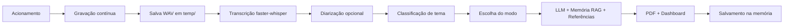

# HERMES 🕵️

Assistente que **observa conversas** (das quais não participa), interpreta o contexto e gera artefatos úteis — como resumos em PDF, listas de tarefas, flashcards e atas de reunião, com memória de longo prazo e referências acadêmicas.

> **Status atual:** Fase 3 em andamento — pipeline completo funcional, com dashboard ao vivo e memória via RAG.
>
> Repositório: https://github.com/Renan-Longo-de-Menezes/Hermes_Project

---

## ⚠️ Privacidade e consentimento

O HERMES grava conversas. **Use apenas com o consentimento de todos os participantes** e avise quando estiver ativo. Respeite a LGPD.

---

## ✅ Funcionalidades implementadas

| Área | Recurso |
|------|---------|
| 🎙️ Captura | Microfone via `sounddevice`, stream contínuo, limite de gravação configurável |
| 🔔 Acionamento | Modo teclado (ENTER) e modo wake word (`openWakeWord`) |
| 📝 Transcrição | `faster-whisper` com timestamps e diarização opcional |
| 🗣️ Diarização | `pyannote.audio` (requer `HF_TOKEN`) — identifica "Pessoa 1", "Pessoa 2" etc. |
| 🏷️ Classificação | LLM classifica a conversa em: aula, debate, reunião, entrevista, apresentação, conversa informal, notícia |
| 🧠 Análise | 6 modos: Resumo, Prós/Contras, Análise Moral, TODO, Flashcards (Anki) e Ata de reunião |
| 💾 Memória | ChromaDB + RAG recupera conversas anteriores relevantes |
| 📚 Referências | Semantic Scholar API (papers acadêmicos sugeridos) |
| 📄 PDF | Geração via `xhtml2pdf`, com Markdown convertido para HTML |
| 🖥️ Dashboard | FastAPI com histórico, status ao vivo e download de PDF |
| 🗣️ TTS | Configuração pronta para `edge-tts` (integração pendente) |

---

## 📁 Estrutura do projeto

```
hermes/
├── fonts/
├── memory_db/              # persistência ChromaDB
├── output/                 # PDFs e HTMLs gerados
├── temp/                   # áudio temporário (captura.wav)
├── .env
├── .env.example
├── .gitignore
├── pyproject.toml
├── README.md
├── requirements.txt
├── requirements-diarization.txt
├── run.py                  # entry point
├── test_audio.py
└── src/hermes/
    ├── __init__.py
    ├── config.py           # configurações via .env
    ├── main.py             # orquestrador principal
    ├── audio/
    │   ├── capture.py
    │   ├── diarizer.py
    │   └── wake_word.py
    ├── brain/
    │   ├── classifier.py
    │   ├── extractors.py
    │   ├── llm.py
    │   └── llm_client.py
    ├── dashboard/
    │   ├── server.py
    │   └── templates/index.html
    ├── memory/
    │   ├── memory.py
    │   └── vector_store.py
    ├── output/
    │   └── pdf_builder.py
    ├── references/
    │   └── semantic_scholar.py
    └── stt/
        └── transcriber.py
```

---

## 🚀 Instalação

### 1. Crie o ambiente virtual

```bash
python -m venv .venv
source .venv/bin/activate      # Windows: .venv\Scripts\activate
```

### 2. Instale as dependências

```bash
pip install -r requirements.txt
```

> ⚠️ **Dependências do dashboard não estão no requirements.txt ainda.**
> Se o dashboard falhar, instale manualmente:
>
> ```bash
> pip install fastapi uvicorn jinja2
> ```

> **Diariação (opcional, pesado):**
>
> ```bash
> pip install -r requirements-diarization.txt
> ```
>
> Requer token do Hugging Face (`HF_TOKEN`) no `.env`.

> **Dica Linux:** se `sounddevice` falhar, instale `libportaudio2`.
> **Para Ollama:** baixe em https://ollama.com e rode `ollama pull llama3.1`.

### 3. Configure o `.env`

```bash
cp .env.example .env
```

Edite as variáveis conforme necessário (veja tabela abaixo).

### 4. Rode

```bash
python run.py
```

---

## 🎮 Uso

1. Escolha um **modo de análise** (1–6 ou `auto`).
2. Pressione **ENTER** (ou diga o wake word) para ativar o HERMES.
3. Fale naturalmente — o HERMES escuta a conversa inteira.
4. Acione novamente para parar e processar.
5. O PDF será salvo em `output/`.

---

## 📊 Modos de análise

| Tecla | Modo | Descrição |
|-------|------|-----------|
| `1` | Resumo + Referências | Tema principal, pontos-chave, conclusões e referências acadêmicas |
| `2` | Prós e Contras | Argumentos a favor, contra, pontos neutros e conclusão equilibrada |
| `3` | Análise Moral/Ética | Utilitarismo, deontologia, ética das virtudes e dilemas |
| `4` | Lista de Tarefas | Extrai TODOs, responsáveis, prazos e prioridades |
| `5` | Flashcards (Anki) | Gera cards pergunta/resposta e exporta CSV para Anki |
| `6` | Ata de Reunião | Cabeçalho, deliberações, encaminhamentos e encerramento |
| `auto` | Automático | Classifica o tema e escolhe o modo ideal |

---

## 🔧 Configuração (.env)

| Variável | Padrão | Descrição |
|----------|--------|-----------|
| `whisper_model` | `small` | Modelo faster-whisper (`tiny`, `base`, `small`, `medium`, `large`) |
| `whisper_device` | `cpu` | `cpu`, `cuda` ou `auto` |
| `llm_provider` | `ollama` | `ollama` ou `openai` |
| `ollama_model` | `llama3.1` | Modelo Ollama usado nas análises |
| `openai_api_key` | — | Chave da OpenAI (se provider for `openai`) |
| `sample_rate` | `16000` | Taxa de amostragem do microfone |
| `max_recording_seconds` | `300` | Limite máximo de gravação |
| `keyboard_mode` | `true` | Usar ENTER em vez de wake word |
| `wake_word_model` | `hey_jarvis` | Modelo openWakeWord (padrão atual) |
| `HF_TOKEN` | — | Token para diarização com pyannote |
| `memory_enabled` | `true` | Ativa memória RAG |
| `semantic_scholar_enabled` | `true` | Ativa referências acadêmicas |
| `tts_enabled` | `false` | Ativa TTS (integração pendente) |

---

## 🌐 Dashboard

Enquanto o HERMES roda, o dashboard fica disponível em:

```
http://127.0.0.1:8765
```

- Status ao vivo: `idle`, `recording`, `processing`
- Histórico de sessões com tema, modo e duração
- Download do PDF de cada sessão
- Exportação em JSON e TXT

---

## 🔄 Fluxo de processamento



---

## 🧾 Correções aplicadas — v0.3.2

- [x] Removido consumo duplo do stream de áudio (wake word agora usa `feed()`)
- [x] Eliminada dependência circular em `classifier.py` (usa `LLMClient` direto)
- [x] PDF agora converte Markdown real (títulos, listas, negrito) via lib `markdown`
- [x] Dashboard com persistência de histórico em JSON
- [x] Dashboard com `threading.Lock` para evitar corridas de estado
- [x] `markdown` adicionado ao `requirements.txt`

---

## 📋 Lista de pendências por prioridade

### 🔴 Alta

- [ ] **Adicionar `fastapi`, `uvicorn` e `jinja2` ao `requirements.txt`** — hoje o dashboard não sobe sem instalar manualmente
- [ ] **Tratar timeout e retry** nas chamadas ao LLM (Ollama/OpenAI) e à Semantic Scholar
- [ ] **Validar o fluxo completo em integração** (gravação → transcrição → PDF) em Linux e Windows

### 🟡 Média

- [ ] **Implementar TTS opcional** — usar `edge-tts` para reproduzir o resumo ao final do processamento
- [ ] **Substituir reload a cada 5s** por WebSocket/SSE no dashboard
- [ ] **Melhorar a fusão transcrição + diarização** com word-level timestamps (hoje usa sobreposição de segmentos)
- [ ] **Adicionar fallback local** quando Semantic Scholar estiver fora do ar

### 🟢 Baixa

- [ ] **Treinar/integrar modelo de wake word customizado** para a palavra "Hermes" (hoje padrão é `hey_jarvis`)
- [ ] **Adicionar testes automatizados** com `pytest` para módulos críticos (`transcriber`, `classifier`, `pdf_builder`)
- [ ] **Empacotar com `pyproject.toml`** para instalação via `pip install -e .`
- [ ] **Exportar histórico em CSV** diretamente pelo dashboard
- [ ] **Suporte a múltiplos dispositivos de entrada** selecionáveis via `.env`

---

## 📚 Roadmap consolidado

- **Fase 0 — Prova de conceito** ✅ Concluída
  - Wake word/teclado, gravação, transcrição, resumo, PDF

- **Fase 1 — MVP real** ✅ Concluída
  - Diarização, classificação de tema, 3 modos de análise, PDF formatado

- **Fase 2 — Inteligência** ✅ Concluída
  - Memória RAG (ChromaDB), referências acadêmicas (Semantic Scholar), TTS configurado

- **Fase 3 — Diferenciais** 🔄 Em andamento
  - Dashboard web ao vivo, flashcards/Anki, ata de reunião
  - Pendente: integração TTS, WebSocket no dashboard, testes

- **Fase 4 — Futuro**
  - Modo 100% local com Ollama otimizado
  - Integração com calendário/agenda
  - Resumo automático de reuniões agendadas